<div align="center">



<h1>EKF-HIL Sat</h1>

<h3>Validação de Algoritmos Robustos de ADCS para Nanossatélites com Hardware COTS em Ambiente HIL Físico</h3>

[](.)
[](.)
[](LICENSE)

<br/>

**[Contexto](#contexto)&nbsp;·&nbsp;[Stack](#stack-tecnológica)&nbsp;·&nbsp;[Estrutura](#estrutura-do-repositório)&nbsp;·&nbsp;[Equipe](#equipe)&nbsp;·&nbsp;[Cronograma](#cronograma)&nbsp;·&nbsp;[Reproduzir](#como-reproduzir)&nbsp;·&nbsp;[Referências](#referências)**

</div>

---

## Contexto

A filosofia do New Space propõe que as limitações inerentes ao hardware comercial de baixo custo (COTS) podem ser sistematicamente compensadas por software de alta complexidade. Este projeto adota essa premissa como hipótese central de pesquisa: **é possível determinar e controlar a atitude de um nanossatélite com precisão aceitável utilizando exclusivamente hardware de entrada e alto nível de ruído, desde que os algoritmos embarcados sejam suficientemente robustos?**

Para responder a essa questão experimentalmente, a plataforma educacional PION Sat é acoplada a atuadores magnéticos customizados em PCB e submetida a testes em um simulador físico de 3 graus de liberdade (3-DOF), composto por mancal a ar esférico e Gaiola de Helmholtz. O principal desafio de engenharia é a implementação de um Filtro de Kalman Estendido (EKF) embarcado, capaz de operar em tempo real sob forte interferência magnética autogerada pelas próprias bobinas de atuação.

> Os resultados serão documentados em um artigo de Prova de Conceito (PoC).

---

## Stack Tecnológica

<table>
  <tr>
    <td valign="top" width="50%">

**Embarcado**
- **C/C++** — Firmware do EKF e drivers dos atuadores
- **FreeRTOS** — Gerenciamento de tarefas em tempo real
- **ESP32** — Microcontrolador do PION Sat
- **I2C** — Interface de comunicação com a IMU de 9 eixos
- **PWM** — Controle dos drivers de ponte-H

**Hardware e EDA**
- **KiCAD** — Projeto das PCBs dos magnetorquers
- **Drivers de potência** — Pontes-H e conversores lógicos 3.3 V/5 V

  </td>
    <td valign="top" width="50%">

**Simulação e Telemetria**
- **Python** — Ground Station e gerenciamento dos sockets UDP
- **UDP** — Protocolo de comunicação com latência alvo < 15 ms
- **IGRF-13** — Modelo do campo geomagnético terrestre
- **Propagador de dinâmica orbital** — Baseado nas equações de Euler

**Infraestrutura**
- **GitHub Actions** — Pipeline de integração contínua (CI/CD)
- **Suíte de testes** — Critérios de aceitação mensuráveis

  </td>
  </tr>
</table>

---

## Estrutura do Repositório

```text
ekf-hil-sat/
│
├── src/
│   ├── firmware/          # Código C/C++ embarcado (EKF, B-dot, drivers)
│   │   ├── ekf/           # Implementação do Filtro de Kalman Estendido
│   │   ├── control/       # Algoritmo B-dot e leis de controle
│   │   └── drivers/       # IMU, magnetorquers, comunicação
│   └── ground_station/    # Estação de solo em Python
│       ├── telemetry/     # Recepção e parsing UDP
│       └── visualizer/    # Renderizador 3D do satélite
│
├── sim/                   # Simulador orbital e dinâmico
│   ├── propagator/        # Equações de Euler + modelo IGRF
│   └── helmholtz/         # Modelo da Gaiola de Helmholtz
│
├── hardware/              # Arquivos KiCAD das PCBs dos magnetorquers
│   ├── magnetorquer_x/
│   ├── magnetorquer_y/
│   └── magnetorquer_z/
│
├── docs/                  # Documentação técnica e relatórios
│   ├── proposta/
│   ├── relatorios/
│   └── paper/             # Manuscrito IEEE (PoC)
│
├── tests/                 # Critérios de aceitação e logs de validação
└── scripts/               # Utilitários de calibração e análise de dados
```

---

## Equipe

| Membro | Frente | Responsabilidades |
|:---:|---|---|
| **S1** | Software — Firmware | EKF em C++, drivers de IMU, geração de PWM para os magnetorquers |
| **S2** | Software — Telemetria | Ground Station, sockets UDP, renderizador 3D |
| **A1** | Aeroespacial — GNC & HW | Sintonia do EKF, lei de controle B-dot, projeto das PCBs no KiCAD |
| **A2** | Aeroespacial — Dinâmica & HIL | Propagador orbital, calibração da Gaiola de Helmholtz e do mancal a ar |

---

## Cronograma

```text
Semanas  1-4  | ████████░░░░░░░░░░░  Fase 1: Design Eletrônico e Firmware
Semanas  5-8  | ░░░░████████░░░░░░░  Fase 2: Manufatura e Debugging Elétrico
Semanas 9-12  | ░░░░░░░░████████░░░  Fase 3: Calibração e Laboratório
Semanas 13-15 | ░░░░░░░░░░░░██████░  Fase 4: Malha Fechada e Validação HIL
Semanas 16-18 | ░░░░░░░░░░░░░░░███░  Fase 5: Métricas e Produção Acadêmica
```

---

## Como Reproduzir

```bash
# Clonar o repositório
git clone https://github.com/seu-org/ekf-hil-sat.git
cd ekf-hil-sat

# Firmware (requer PlatformIO ou ESP-IDF)
cd src/firmware
pio run

# Ground Station
cd src/ground_station
pip install -r requirements.txt
python main.py

# Simulador
cd sim
python propagator/run_simulation.py
```

> Consulte [docs/setup.md](docs/setup.md) para o guia completo de configuração do ambiente.

---

## Participantes

<table>
  <tr>
    <td align="center">
      <a href="https://github.com/mmonteirov">
        <br/>
        <sub><b>Mateus Verly</b></sub>
      </a>
    </td>
    <td align="center">
      <a href="https://github.com/ThalitaCAguiar">
        <br/>
        <sub><b>Thalita Aguiar</b></sub>
      </a>
    </td>
    <td align="center">
      <a href="https://github.com/pedrolrm">
        <br/>
        <sub><b>Pedro Manera</b></sub>
      </a>
    </td>
    <td align="center">
      <a href="https://github.com/diangellis">
        <br/>
        <sub><b>Gabriel Di Angellis</b></sub>
      </a>
    </td>
  </tr>
</table>

---

## Referências

- Markley, F. L.; Crassidis, J. L. *Fundamentals of Spacecraft Attitude Determination and Control*. Springer, 2014.
- NOAA/IAGA. *International Geomagnetic Reference Field — IGRF-13*, 2020.
- Welch, G.; Bishop, G. *An Introduction to the Kalman Filter*. UNC Chapel Hill, 2006.
- Cubespace. *B-dot Controller Theory and Implementation for CubeSats*.

---

## Licença

Distribuído sob a licença **MIT**. Consulte [LICENSE](LICENSE) para mais detalhes.
