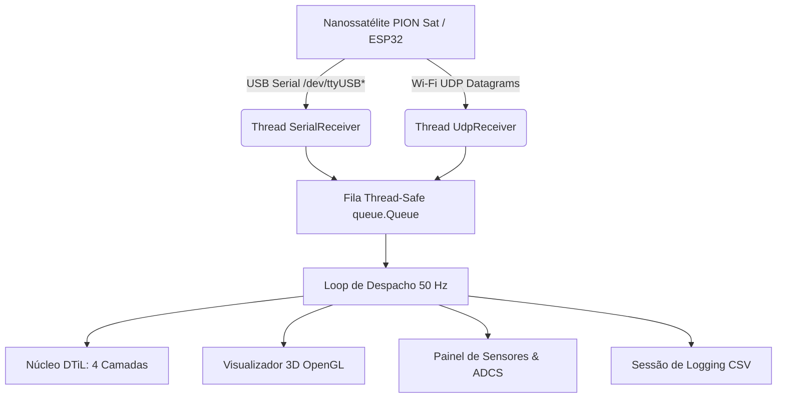

# Guia Operacional — Ground Station 3D & Gêmeo Digital (PION Sat)

Este documento descreve a arquitetura, operação e funcionalidades da Estação de Solo (Ground Station) e do Gêmeo Digital em Tempo Real (*Digital Twin-in-the-Loop — DTiL*) desenvolvidos para o nanossatélite **PION Sat** (ADCS PionSat UnB).

---

## 1. Visão Geral do Sistema

A Ground Station é uma aplicação gráfica de padrão aeroespacial em **PyQt6**, projetada para recepção, deserialização e visualização síncrona de telemetria binária de baixa latência (< 15 ms).



---

## 2. Abas da Interface Gráfica

A interface é dividida em **5 abas modulares independentes**:

### Aba 1 — Visão Geral & Atitude 3D
- **Viewport 3D OpenGL (60 FPS):** Renderiza o modelo CAD oficial (`hardware/cad/Sat com chassi.step`) com texturização de alto contraste (PCBs em azul, verde, púrpura e âmbar; bateria em laranja ouro; barramentos de cobre e estrutura de alumínio).
- **Atitude em Tempo Real:** Orientação orientada por Quatérnios ($q_w, q_x, q_y, q_z$) e Ângulos de Euler (Roll, Pitch, Yaw).
- **Vetor de Campo Magnético ($\mathbf{B}$):** Seta amarela em escala representando a orientação do campo geomagnético medido.
- **Botão `CHASSI: VISÍVEL / OCULTO`:** Alterna dinamicamente a visibilidade da estrutura externa para inspeção visual da pilha interna de placas e baterias.
- **Botão `REINICIAR CÂMERA 3D`:** Centraliza a câmera na origem espacial `(0, 0, 0)`.
- **Botão `ATIVAR/DESATIVAR EMULAÇÃO`:** Inicia/interrompe injeção contínua de telemetria simulada sem necessidade de hardware físico conectado.

### Aba 2 — Sensores Ambientais & Housekeeping
- **Indicadores Numéricos & Gráficos Temporais:**
  - **Perfil de Energia:** Tensão da bateria ($V$), corrente ($mA$), potência ($mW$) e Estado de Carga ($SoC\%$).
  - **Concentração de Dióxido de Carbono ($CO_2$):** Medição em $ppm$.
  - **Intensidade Luminosa:** Sensor solar / LDR em $Lux$.
  - **Climatologia Embarcada:** Umidade relativa ($\%RH$) e pressão barométrica ($hPa$).

### Aba 3 — Telemetria ADCS & Dinâmica
- **Giroscópios Triaxiais:** Taxas angulares $\omega_x, \omega_y, \omega_z$ em $rad/s$ e $deg/s$.
- **Magnetômetro Triaxial:** Medição de $B_x, B_y, B_z$ e norma $\|\mathbf{B}\|$ em $\mu T$.
- **Atuação & Controle:** Comando de PWM da roda de reação/magnetorquers e estado de convergência do EKF embarcado.

### Aba 4 — Gêmeo Digital & Divergência (DTiL)
- **Erro Angular Geodésico ($\theta_{\text{err}}$):** Diferença angular real entre o satélite físico e a atitude prevista pelo modelo dinâmico do Gêmeo Digital:
  $$\theta_{\text{err}} = 2 \arccos(|q_w^{\text{err}}|) \in [0^\circ, 180^\circ]$$
- **RMSE Deslizante de 120 Segundos:** Histórico de convergência e estabilidade da estimativa.
- **Classificador de Estado de Saúde:**
  - `NOMINAL` (Verde): $\text{RMSE} < 5^\circ$
  - `ATENÇÃO` (Âmbar): $5^\circ \le \text{RMSE} < 15^\circ$
  - `DIVERGENTE / CRÍTICO` (Vermelho): $\text{RMSE} \ge 15^\circ$ ou divergência de filtros.

### Aba 5 — Conexão Serial & Configurações
- **Gerenciador de Portas USB:** Varredura dinâmica de dispositivos seriais conectados (`/dev/ttyUSB*`, `/dev/ttyACM*`, `COM*`).
- **Seletor de Baudrate:** $115200$, $460800$, $921600\text{ bps}$.
- **Gravador de Sessão CSV:** Registro síncrono de todas as variáveis e métricas DTiL em arquivos rotulados por timestamp.

---

## 3. Instruções de Execução

### 3.1 Conexão com o Satélite Físico (USB)
```bash
python src/ground_station/main.py
```
*(A aplicação auto-detecta a porta serial USB conectada e inicia a recepção automaticamente).*

### 3.2 Execução com Transmissor Simulado (Wi-Fi / UDP)
No terminal 1 (inicie a Ground Station):
```bash
python src/ground_station/main.py
```
No terminal 2 (inicie o simulador UDP):
```bash
python scripts/simulate_esp32_transmitter.py --mode udp --freq 20
```

### 3.3 Teste de Injeção de Falhas para Validação do DTiL
```bash
python scripts/simulate_esp32_transmitter.py --mode udp --fault divergence_gyro
```
