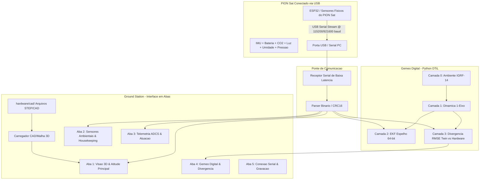

# Especificação Técnica — Gêmeo Digital, Interface de Solo (Ground Station) & Telemetria em Tempo Real (S2)

> **Documento de Requisitos de Engenharia de Software e Diretrizes para Agentes de IA**  
> **Projeto:** EKF-HIL Sat + Digital Twin (PION Sat — UnB)  
> **Responsável:** Engenheiro de Software — Gêmeo Digital & Telemetria / Systems Engineering (S2)  
> **Linguagem Principal:** Python 3.10+ | **Comunicação:** Conexão Direta USB/Serial & UDP (< 15 ms)  
> **Hardware:** PION Sat conectado via porta USB física no computador  
> **Diretrizes Visuais:** Interface profissional de padrão aeroespacial, sem uso de emojis, design moderno, fluido (60 FPS) e estruturado em abas modulares.

---

## 1. Visão Geral e Missão Principal

O objetivo deste módulo é implementar o **Gêmeo Digital (Digital Twin)** e a **Ground Station** para monitoramento e validação física em tempo real do nanossatélite **PION Sat conectado diretamente à porta USB do computador**.

### Prioridades Centrais:
1. **Visualização 3D da Atitude e Posição Relativa em Tempo Real:** Renderizar a orientação espacial exata ($\mathbf{q} = [q_w, q_x, q_y, q_z]$ / Euler $\phi, \theta, \psi$) e deslocamento relativo do satélite em 3D, carregando diretamente a geometria dos arquivos CAD oficiais do projeto (`hardware/cad/Sat com chassi.step` / `hardware/cad/Sat sem chassi.step` ou malhas geradas).
2. **Recepção Direta via USB/Serial (Hardware Real):** Recepção contínua da telemetria transmitida pelo satélite físico conectado via USB (`/dev/ttyUSB*`, `/dev/ttyACM*` ou porta COM), sem depender de mock data para a operação.
3. **Design de Interface Fluido e Estruturado em Abas:** Organização visual limpa e elegante, evitando sobrecarga de informações em uma única tela. Utilização de abas funcionais, tipografia técnica de alta legibilidade, tema escuro e sem utilização de emojis.
4. **Monitoramento Completo dos Sensores Embarcados:** Exibição imediata em tempo real dos seguintes dados:
   - **Posição Relativa e Atitude:** $\Delta X, \Delta Y, \Delta Z$, Quatérnios e Ângulos de Euler.
   - **Dióxido de Carbono (CO2):** Concentração em ppm.
   - **Luminosidade / Luz:** Intensidade em Lux.
   - **Umidade Relativa:** Porcentagem (% RH).
   - **Pressão Atmosférica:** Leitura em hPa / Pa.
   - **Bateria / Energia:** Tensão (V), Corrente (mA) e Estado de Carga (SoC %).
   - **Dinâmica ADCS:** Velocidade angular ($\boldsymbol{\omega}$), Campo Magnético ($\mathbf{B}$), PWM/Torque e estado de convergência do EKF.
5. **Núcleo do Gêmeo Digital em 4 Camadas (DTiL):** Processar a telemetria recebida através das Camadas 0 a 3, executando o EKF espelho e calculando métricas de divergência (RMSE) entre a simulação e o hardware físico.



---

## 2. Delimitação de Escopo (Fronteiras de Trabalho)

### Dentro do Escopo (Responsabilidade S2 — Gêmeo Digital & Ground Station):
1. **Receptor USB/Serial de Alta Performance:**
   - Comunicação serial direta com a porta USB do computador (auto-detecção de portas, baud rate configurável ex: 115200 ou 921600 bps, thread dedicada não-bloqueante).
   - Suporte transparente a transporte UDP quando em rede.
2. **Visualizador 3D com CAD Real do Satélite:**
   - Carregamento e renderização da malha 3D baseada nos modelos CAD oficiais em `hardware/cad/` (`Sat com chassi.step` / `Sat sem chassi.step`).
   - Rotação e posicionamento em tempo real a 60 FPS orientados pelos quatérnios $\mathbf{q}$ e vetor de posição relativa recebidos do satélite.
   - Sobreposição de vetores de campo magnético ($\mathbf{B}$ medido e modelo) e eixos de coordenadas Body/Lab.
3. **Design UI/UX em Abas (Sem Emojis, Fluido e Organizado):**
   - Estrutura em abas lógicas para evitar congestionamento visual.
   - Gráficos de alta taxa (PyQtGraph) com histórico deslizante e baixo consumo de CPU.
   - Cards limpos com tipografia monospace para valores numéricos e indicadores de status com cores normativas (verde, âmbar, vermelho).
4. **Núcleo do Gêmeo Digital (Python DTiL):**
   - Camadas 0 (Ambiente/IGRF-14), 1 (Dinâmica 1-eixo), 2 (EKF espelho 64-bit) e 3 (Cálculo de divergência e logging).
5. **Utilitário Mínimo de Teste de Hardware (se necessário):**
   - Script/firmware minimalista de teste apenas para transmitir o fluxo de telemetria dos sensores do ESP32 pela serial caso o firmware principal de S1 ainda não esteja carregado.

### Fora do Escopo Desta Spec (Responsabilidade S1 — Firmware / EKF Embarcado):
* Desenvolvimento do EKF embarcado em C++ de alta complexidade, arquitetura avançada de tarefas FreeRTOS, driver final de PWM para a bancada e controle fino de malha fechada no ESP32.

---

## 3. Especificação do Protocolo de Telemetria (ICD Binário)

Os pacotes trafegam tanto pela porta serial USB quanto por UDP em estrutura binária compacta (*little-endian*, 76 bytes).

### 3.1. Estrutura do Pacote de Telemetria (`TelemetryPacket`)
* **Header de Sincronismo:** `0xAA55` (2 bytes)
* **Tamanho do Pacote:** 76 bytes
* **Taxa de Transmissão:** 10 Hz a 50 Hz via USB Serial

| Offset | Campo | Tipo | Bytes | Unidade | Descrição / Faixa |
|---|---|---|---|---|---|
| `0..1` | `header` | `uint16` | 2 | — | Sincronismo (`0xAA55`) |
| `2` | `packet_id` | `uint8` | 1 | — | Tipo de pacote (`0x01` = Telemetria Completa) |
| `3` | `sys_mode` | `uint8` | 1 | — | Modo (0: Idle, 1: B-Dot, 2: Pointing, 3: Calib) |
| `4..7` | `timestamp_ms` | `uint32` | 4 | ms | Tempo desde o boot do satélite |
| `8..23` | `q_w, q_x, q_y, q_z` | `float32[4]` | 16 | adim. | Quatérnio de atitude estimado ($\|\mathbf{q}\|=1$) |
| `24..35` | `gyro_x, y, z` | `float32[3]` | 12 | rad/s | Velocidade angular medida pela IMU |
| `36..47` | `mag_x, y, z` | `float32[3]` | 12 | $\mu\text{T}$ | Campo magnético medido / calibrado |
| `48..53` | `rel_pos_x, y, z` | `int16[3]` | 6 | mm | Posição relativa na bancada de ensaio |
| `54..55` | `co2_ppm` | `uint16` | 2 | ppm | Concentração de CO2 ($0$ a $5000\text{ ppm}$) |
| `56..57` | `light_lux` | `uint16` | 2 | Lux | Intensidade luminosa ($0$ a $65535\text{ Lux}$) |
| `58..59` | `humidity_raw` | `uint16` | 2 | $0.01\,\%$ | Umidade relativa escalonada ($0..10000 \implies 0..100\%$) |
| `60..63` | `pressure_pa` | `float32` | 4 | Pa | Pressão atmosférica absoluta |
| `64..65` | `v_bat_mv` | `uint16` | 2 | mV | Tensão da bateria ($0$ a $5000\text{ mV}$) |
| `66..67` | `i_bat_ma` | `int16` | 2 | mA | Corrente de carga/descarga ($-2000$ a $+2000\text{ mA}$) |
| `68` | `soc_percent` | `uint8` | 1 | % | Estado de Carga da Bateria ($0$ a $100\%$) |
| `69` | `ekf_status` | `uint8` | 1 | — | Status do filtro (0: Init, 1: Divergente, 2: Convergido) |
| `70..71` | `actuator_pwm` | `int16` | 2 | — | Comando do atuador ($-1000$ a $+1000$) |
| `72..73` | `seq_num` | `uint16` | 2 | — | Número sequencial do pacote |
| `74..75` | `checksum` | `uint16` | 2 | — | Checksum CRC-16-CCITT sobre os bytes 0..73 |

### 3.2. Formato de Desempacotamento Python (`struct`)
```python
STRUCT_FORMAT = "<HBB I 4f 3f 3f 3h HHH f HhBB h H H"
STRUCT_SIZE = 76  # bytes
```

---

## 4. Arquitetura da Interface em Abas (UI/UX)

Para manter a clareza e evitar sobrecarga visual, a interface é estruturada em **cinco abas temáticas principais**:

### Aba 1: Visão Geral & Atitude 3D
* **Viewport 3D Principal:** Visualização em tela cheia ou área de destaque do modelo CAD do satélite em rotação contínua (quatérnios reais).
* **Barra Lateral de Resumo:**
  - Posição Relativa: $\Delta X, \Delta Y, \Delta Z$ (mm).
  - Atitude: Roll, Pitch, Yaw em graus.
  - Indicador de Nível de Bateria (Tensão e SoC %).
  - Status da Conexão Serial (Porta, Baud, Taxa de Pacotes/s).

### Aba 2: Sensores Ambientais & Housekeeping
* **Cards Dedicados:**
  - Bateria: Tensão ($V$), Corrente ($mA$), Potência ($mW$), Barra de SoC (%) com código de cores formal.
  - Dióxido de Carbono (CO2): Valor em ppm com gráfico histórico e limites de saturação.
  - Luminosidade: Leitura em Lux com indicador analógico e série temporal.
  - Umidade e Pressão: Valores numéricos de alta resolução e gráfico climático conjunto.
* **Histórico Temporal dos Sensores:** Gráficos sincronizados com janela deslizante de tempo configurável (1 min, 5 min, 15 min).

### Aba 3: ADCS & Dinâmica
* **Velocidades Angulares:** Três gráficos para $\omega_x, \omega_y, \omega_z$ com zoom e medição de amplitude.
* **Campo Magnético:** Vetor $\mathbf{B}$ medido pelo magnetômetro vs. vetor previsto.
* **Atuação:** Ciclo de trabalho PWM aplicado aos magnetorquers / roda de reação.
* **Estado do Filtro EKF:** Incerteza da covariância ($P$) e estado de convergência.

### Aba 4: Gêmeo Digital & Divergência
* **Comparador Twin vs. Hardware:**
  - Gráfico de Erro Angular ($\theta_{\text{err}}$) ao longo do tempo.
  - Gráficos comparativos de $\boldsymbol{\omega}_{\text{sat}}$ vs. $\boldsymbol{\omega}_{\text{twin}}$.
  - Métrica de RMSE de atitude em janela móvel de 120 segundos.
* **Painel de Saúde do Enlace:** Latência média, jitter e contador de pacotes descartados/corrompidos.

### Aba 5: Conexão Serial & Configurações
* **Gerenciador de Conexão:** Dropdown de portas seriais disponíveis (`/dev/ttyUSB0`, etc.), seletor de baud rate (115200, 921600) e botão de conexão.
* **Gravação de Dados:** Botão para iniciar/parar registro em arquivo CSV com indicador de duração da sessão e tamanho do arquivo.
* **Calibração & Reset:** Comandos para zerar referências e reiniciar filtros.

---

## 5. Visualização 3D e Modelos CAD

1. **Modelos CAD no Repositório:**
   - Localizados em: `hardware/cad/Sat com chassi.step` e `hardware/cad/Sat sem chassi.step`.
   - Loader/conversor (`src/ground_station/visualizer/cad_loader.py`) para carregar a malha e gerar malha triangular otimizada em cache.
2. **Renderização:**
   - Viewport acelerada por hardware via OpenGL / PyQtGraph `GLViewWidget`.
   - Eixos de coordenadas do satélite (Body Frame: $X$-Vermelho, $Y$-Verde, $Z$-Azul) e vetor de campo magnético medido $\mathbf{B}$.
   - Deslocamento tridimensional suave conforme a posição relativa ($\Delta X, \Delta Y, \Delta Z$).

---

## 6. Estrutura de Diretórios do Módulo

```text
ADCS-PION-SAT-UNB/
├── src/
│   ├── ground_station/                # Interface Gráfica e Apresentação
│   │   ├── __init__.py
│   │   ├── main.py                    # Ponto de entrada da Ground Station
│   │   ├── app.py                     # Janela Principal PyQt6 (QTabWidget)
│   │   ├── telemetry/                 # Conexão Serial USB e Protocolo
│   │   │   ├── __init__.py
│   │   │   ├── packet_definitions.py  # Dataclasses e deserializador binário (76 bytes)
│   │   │   ├── serial_receiver.py     # Thread de recepção USB/Serial com buffer circular
│   │   │   ├── udp_receiver.py        # Receptor UDP complementar
│   │   │   └── logger.py              # Gravador de logs de ensaio em CSV
│   │   ├── visualizer/                # Visualizador 3D com CAD
│   │   │   ├── __init__.py
│   │   │   ├── attitude_renderer_3d.py# Viewport 3D acelerada por hardware (OpenGL)
│   │   │   └── cad_loader.py          # Processador e carregador dos arquivos STEP/CAD
│   │   └── ui/                        # Abas e Widgets da Interface
│   │       ├── __init__.py
│   │       ├── tab_3d_attitude.py     # Aba 1: Viewport 3D e resumo de atitude
│   │       ├── tab_sensors.py         # Aba 2: Painel de Sensores Ambientais
│   │       ├── tab_adcs.py            # Aba 3: Gráficos de dinâmica e atuadores
│   │       ├── tab_divergence.py      # Aba 4: Gráficos de divergência Twin vs Físico
│   │       ├── tab_settings.py        # Aba 5: Gerenciador de portas USB e gravação
│   │       └── style.py               # Tema escuro aeroespacial moderno
│   │
│   ├── twin/                          # Núcleo do Gêmeo Digital (DTiL)
│   │   ├── __init__.py
│   │   ├── digital_twin_engine.py     # Orquestrador do Gêmeo Digital
│   │   └── layers/                    # As 4 Camadas DTiL
│   │       ├── layer0_env.py          # Camada 0: Ambiente IGRF-14
│   │       ├── layer1_dynamics.py     # Camada 1: Dinâmica 1-Eixo
│   │       ├── layer2_ekf_mirror.py   # Camada 2: EKF Espelho 64-bit
│   │       └── layer3_divergence.py   # Camada 3: Cálculo de Divergência RMSE
│   │
│   └── firmware/                      # [FORA DE ESCOPO - S1]
│
├── hardware/cad/                      # Modelos CAD (.step) do satélite
└── tests/                             # Testes automatizados (pytest)
    ├── test_packet_definitions.py
    ├── test_serial_parser.py
    ├── test_cad_loader.py
    └── test_ekf_mirror.py
```

---

## 7. Critérios de Aceitação

| Item | Requisito | Validação |
|---|---|---|
| **Conexão USB** | Leitura contínua a 115200/921600 bps sem travar | Teste com satélite conectado à porta USB |
| **Visualização 3D** | Renderização fluida do CAD a $\ge 30\text{ FPS}$ | Resposta em tempo real à rotação física do satélite |
| **UI/UX em Abas** | Layout modular, sem poluição visual e sem emojis | Inspeção de interface gráfica |
| **Exibição de Sensores** | 100% dos sensores exibidos em suas respectivas abas | Conferência direta no painel com dados reais |
| **Integridade de I/O** | Zero congelamentos na interface durante fluxo contínuo de dados | Thread desacoplada com `queue.Queue` |
| **Gêmeo Digital** | Cálculo de divergência e EKF espelho rodando em tempo real | Telemetria física espelhada no modelo dinâmico |
