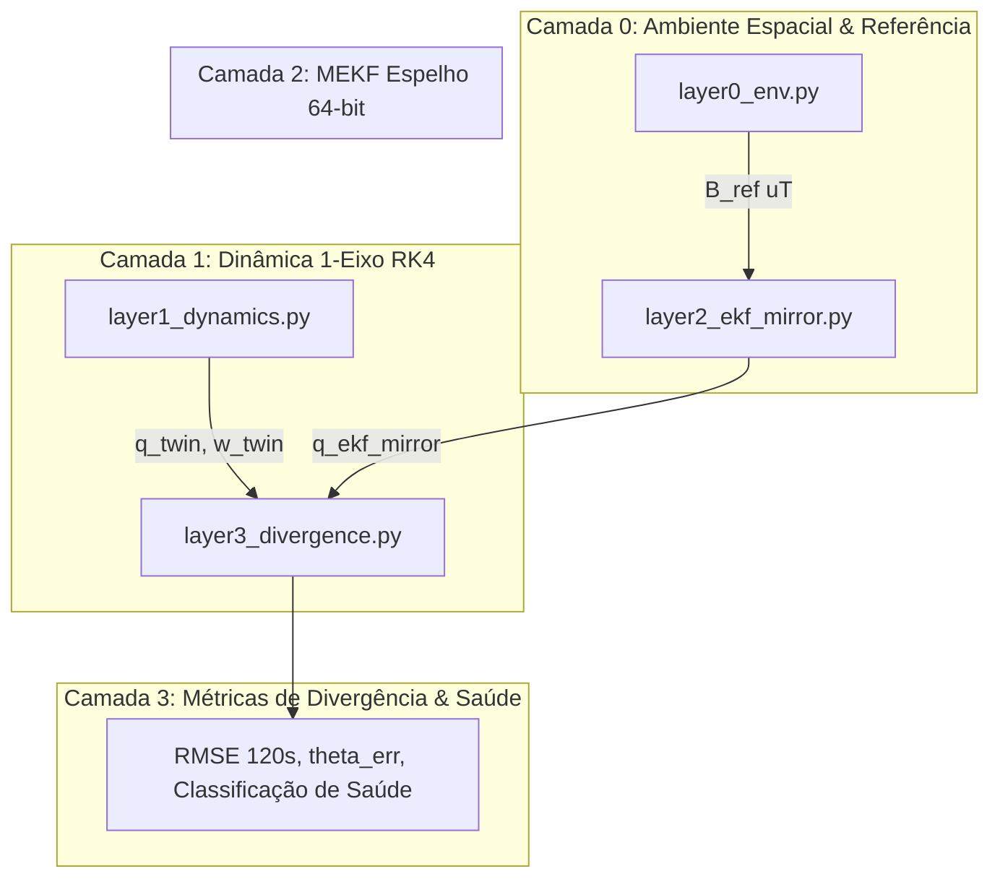

# Núcleo do Gêmeo Digital (Digital Twin-in-the-Loop — DTiL)

Este diretório contém a implementação do motor do Gêmeo Digital em 4 camadas para o nanossatélite **PION Sat** (ADCS PionSat UnB).

---

## Arquitetura de 4 Camadas

---

## 1. Camada 0: Ambiente Espacial (`layer0_env.py`)
- Modelo geomagnético dipolar e dados de referência IGRF-14 no laboratório de bancada (Brasília: latitude $-15.764^\circ$, longitude $-47.871^\circ$, $B_{\text{NED}} \approx [14.5, -2.5, -19.5]\,\mu\text{T}$).
- Função de projeção do campo de referência inercial para o referencial de corpo (*Body Frame*).

---

## 2. Camada 1: Modelo Dinâmico 1-Eixo (`layer1_dynamics.py`)
- Equações rotacionais de Euler integradas via **Runge-Kutta de 4ª Ordem (RK4)**:
  $$I_{zz} \dot{\omega}_z = \tau_{\text{atuador}} - \tau_{\text{atrito}} - \tau_{\text{ext}}$$
- Inércia nominal oficial derivada do CAD 3D completo: $I_{zz} = 5.25 \times 10^{-4}\,\text{kg}\cdot\text{m}^2$.
- Modelo de atuador com **zona morta** ($|\text{PWM}| \le 20$) e atrito viscoso de mancal a ar.

---

## 3. Camada 2: Filtro de Kalman Estendido Espelho (`layer2_ekf_mirror.py`)
- MEKF (*Multiplicative Extended Kalman Filter*) implementado em **ponto flutuante duplo (64-bit)** para servir de gabarito analítico frente ao EKF embarcado em C++ (32-bit).
- Vetor de estado de erro $\Delta \mathbf{x} = [\delta \boldsymbol{\theta}^T, \Delta \mathbf{b}^T]^T \in \mathbb{R}^6$.
- Matriz de covariância $P \in \mathbb{R}^{6 \times 6}$ propagada com ruído de processo do giroscópio $Q$ e ruído de medição magnetométrica $R$.

---

## 4. Camada 3: Métricas de Divergência & Saúde (`layer3_divergence.py`)
- **Erro Angular Geodésico:**
  $$\theta_{\text{err}} = 2 \arccos(|q_w^{\text{sat} \otimes (\text{twin})^{-1}}|) \times \frac{180^\circ}{\pi}$$
- **RMSE em Janela Deslizante (120 s):**
  $$\text{RMSE}_{\theta} = \sqrt{\frac{1}{N} \sum_{i=1}^N \theta_{\text{err}, i}^2}$$
- **Classificação:** `NOMINAL` ($\le 5^\circ$), `ATENÇÃO` ($5^\circ \sim 15^\circ$), `DIVERGENTE` ($> 15^\circ$).
